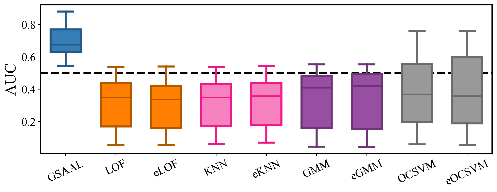

# Generative Subspace Adversarial Active Learning for Unsupervised Outlier Detection

GSAAL focuses on detecting outliers while incorporating the information of the feature subspaces. This is the official implementation of GSAAL introduced by: [PAPER]

Please cite the paper if you use our code. Thank you :)

# Multiple Views Experiments

The following branch contains all of the code necessary for our Multiple Views experiments. We visualized the projected boundary and detected outliers in datasets under Multiple Views. 
We redirect the interested reader to our paper [PAPER] for more information.

## Launching the experiments

To launch the experiments, you first need to get the 2D datasets. You can either check how we generated them in our article or get them using the bash file ```get_synthetic_data.sh``` from the main branch. 

Now, you can simply get Bisect's boundary by running the bash file ```synth_dataset_run.sh``` you can fit the GSAAL model and obtain the 60D datasets. The jupyter notebooks in the branch will help you visualize the datasets of your liking. The python file ```AUC_MV_experiments.py``` lets you reproduce all One-class classification experiments under MV by simply executing it.

### On new data

Reproducing these experiments on new datasets is very easy. Simply create a 2D dataset of your linking, and then add it into a folder named ```synthetic_data``` in ```src/experiments/```. Run everything else as for the other datasets in the bash file. 

### The choice of Hyperparameter... does it matter? 

A natural question that might arise is if, under a proper hyperparameter selection, models could be sensible to change in the subspaces ---even if in practice is usually impossible to tune them. We investigated this question and found that the choice of Hyperparameter ***practically does not affect the boundary***. We will let the results speak for themselves and include in the repository a collection of images for every competitor with gridded hyperparameters in the folder ```src/experiments/images```. 


### To ensemble or not to ensemble for MV

Another way to enhance the performance of an outlier detection method is to create a subspace ensemble, as featured in ^[*C. C. Aggarwal*. Outlier Analysis. Springer International Publishing, Cham, 2017.] and introduced in ^[*Aggarwal, Charu & Sathe, Saket.* (2015). Theoretical Foundations and Algorithms for Outlier Ensembles?. ACM SIGKDD Explorations Newsletter. 17. 24-47. 10.1145/2830544.2830549.]. We wanted to investigate whether this effect also carries to a particular benefit when ensembling in subspaces. For this experiments, we performed the same MV experiments as in [PAPER], but with ensembled version of all shallow classifiers. We used the same amount of ensemble members as classifiers in GSAAL for comparison sake. The hyperparameters for all ensemble members are the same one as the full-space one ---see [PAPER] for more information. The following images contain all of the *projected* boundaries for the shallow methods:


As we can see, almost no difference can be seen for the ensembles with the regular classifiers. To further quantify this, we can see the One-class classification experiment results:

